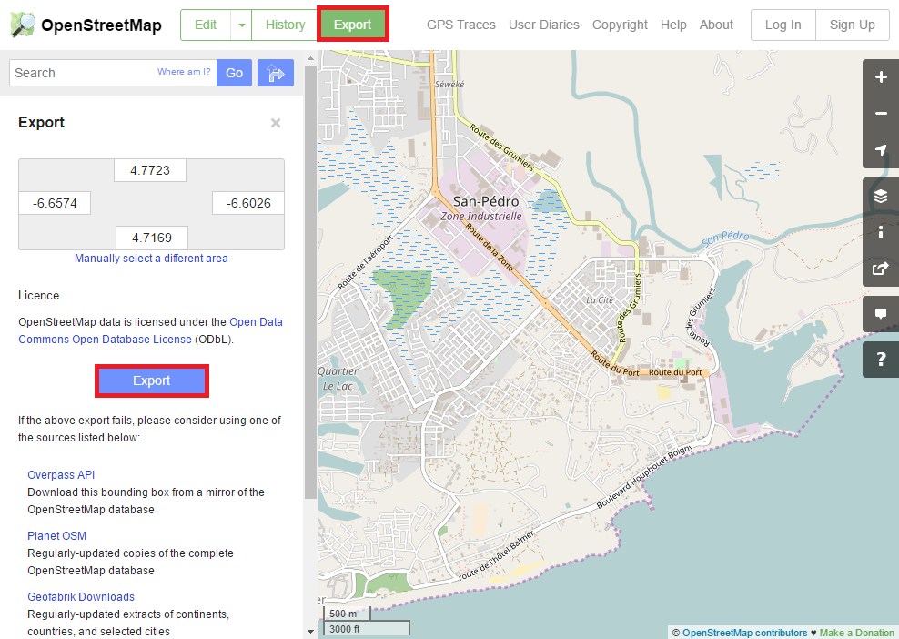
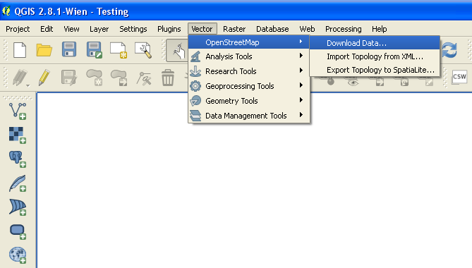
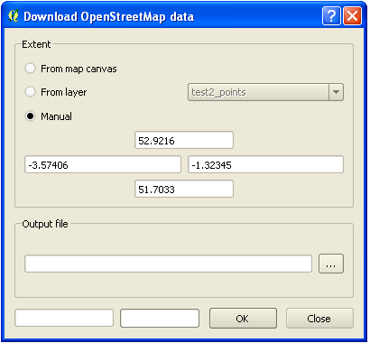
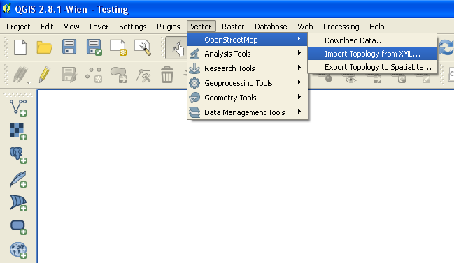
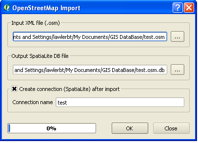
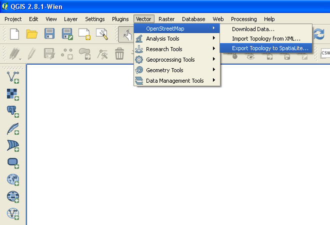
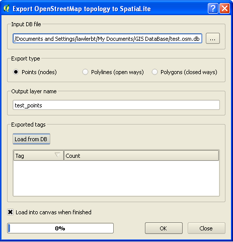
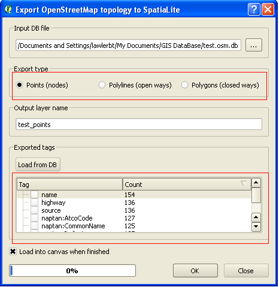

# OpenStreetMap Export Tutorial

## Exporting data from OpenStreetMap

OpenStreetMap (OSM) is open and freely available data. All of data that you help create and upload into OSM, can be extracted back out. As you spend time working with Geographic Information Systems, you may want to utilize OSM data in a GIS software package. There are various different ways you are able to extract data from OpenStreetMap. This guide will compare and contrast different methods so you can choose the best way that fit your needs.

## 1. The Simple Way: Downloading straight from [OpenStreetMap.org](https://openstreetmap.org)

- difficulty: easy
- scale: city-level
- file-format: .osm

This is the easiest and most straightforward way to download OSM data. Go to OpenStreetMap.org and navigate to the area you want to download. The site will not let you download too much data at one time, therefore you need to zoom into about the city level. When you are ready to download the area that is displayed on your screen click on the Export button on the top menu. The left-hand export pane will display. Another option to select an area is by manually inputting the coordinates of the bounding box. Then click on the Export button on the left-hand pane to begin your download. 

A .osm file is a type of XML file that contains OSM data. You can open a .osm file automatically using QGIS, but not ArcGIS.

Note that it is possible to convert a .osm file to other popular geospatial formats, such as shapefiles or geojson. There are many tools to do this. One way to do this is using the [ogr2ogr](gdal.org/programs/ogr2ogr.html#ogr2ogr) command line tool, which is part of the GDAL translator library.

## 2. Another simple way: [Protomaps Minutely Extracts](https://protomaps.com/extracts/)

- difficulty: easy
- scale: city-level
- file-format: .osm.pbf

Download free on-demand OpenStreetMap data for any selected region. Edits from openstreetmap.org appear almost immediately. You can download the data as an osm.pbf file.

## 3. Geofabrik [download](http://download.geofabrik.de/)

- difficulty: easy
- scale: country-level
- file-format: .osm.pdf, shapefile

GeoFabrik has daily data extracts from OSM. These extracts typically cover whole countries and regions. Select your continent and then your country of interest. Options to download include .osm.pbf and shapefiles. 

A .osm.pbf is a compressed .osm file.  You can open a .osm or .osm.pbf file automatically using QGIS, but not ArcGIS.

### shapefile format
In OSM there are no layers in the traditional GIS sense. There are different types of features such as points (nodes), lines (ways), and polygons (closed ways). A feature is defined according to what its tags are, and a tag can be anything. Geofabrik generates shapefiles grouping the most commonly found types of features in OSM into layers that are commonly used in GIS software. For example, one of the layers are roads, which contain the highways, tracks, and paths found in OSM.

You can open shapefiles automatically using QGIS or ArcGIS.

#### How Geofabrik creates different shapefiles using OSM tags

- buildings
- landuse
- natural
- places
- pofw (places of worship)
- pois (points of interest)
- railways
- roads
- traffic
- transport areas
- water
- waterways

## 4. [HOT OSM Export Tool](https://export.hotosm.org/)

The Export Tool creates OpenStreetMap exports for GIS programs and mobile devices. It outputs files in various tabular formats based on an input area of interest polygon and a selection of OpenStreetMap tags. It is synchronized minutely with the main OSM database, so exports can be created to accompany real-time humanitarian mapping efforts.

#### Features:
- it is possible to create your own bounding box
- There are many different formats to choose for download including GeoPackage, shapefile, and KML
- You can choose what layers to download, and it displays the keys for each layer
- You can save and share your export 

## 5. Query to find the exact data you need: Overpass Turbo (https://overpass-turbo.eu/)

- difficulty: medium to advanced
- scale: city
- file-format: various

Overpass Turbo, is a web-based data filtering tool for OpenStreetMap. With Overpass Turbo you can run Overpass API queries and analyse the resulting OSM data interactively on a map. There is an integrated Wizard which makes creating queries super easy. There is a limit to how much you can download so you may need to limit your searches. There are also some nifty queries you can make such are compare differences over different time periods 

## 6. Download the whole planet - Planet.osm.org

- difficulty: medium
- scale: world
- file-format: .osm.pbf

Downloading the whole planet can be useful in certain use cases including research, generating metrics, and looking at historical data. The drawback is that the size of these files are very large. An uncompressed .osm that covers the whole planet is over 800GB. On this site you can download compressed files that are smaller (over 35GB) but still large. You can also download history planet files that contain historical OSM information.

Often another need that arises is that once you download the whole planet file you want to keep it up-to-date. If you are interested in this, you may want to look at the [docker-osm](https://github.com/kartoza/docker-osm) project. 

Also note that the technology behind Protomaps is [OSM Express (OSMX)](https://github.com/protomaps/OSMExpress). If you are interested in keeping a planet file up-to-date, or also quickly extracting a bounding box from a planet file, look into OSMX.

Finally, OSMIUM (https://osmcode.org/osmium-tool/) is another great tool for working with OSM files, including extracting data based on bounding boxes, filtering Filter OSM files by tags, extracting data from OSM history files for a given point in time or a time range, and more.

## Other Tools

### OSM Extracts
https://www.interline.io/osm/extracts/
Each day, OSM Extracts by Interline mirrors the entire OpenStreetMap planet and creates city and region sized extracts. It is possible to use this tool with a developer preview.

### Download OSM straight from QGIS 3
QGIS 3 cannot download OSM data as a core functionality. Although, there is a plug-in called [QuickOSM](http://www.qgistutorials.com/it/docs/3/downloading_osm_data.html) that can do this.

### Download OSM straight from QGIS 2

- difficulty: medium
- scale: city
- file-format: .osm, spatialite

QGIS, which is a free, open-source desktop GIS application. QGIS integrates OSM import as a core functionality. 

#### Note: 
Before bringing in any data, first add a basemap. Harvard has a good walkthrough on how to do this by adding the OpenLayers plugin. [Tutorial](http://maps.cga.harvard.edu/qgis/wkshop/basemap.php)

In QGIS, go to Menu "Vector -> OpenStreetMap -> Download data" which will connect to the OSM server and download data. You can select coordinates for the area you want. You can skip this step if you already have a .osm XML file. The server will not let you download too much data at one time, therefore you need to zoom into about the city level.

QGIS is able to load osm files directly (.osm and .osm.pbf files). 

If you need to get the data into a Spatialite database then continue with the following two steps:

On QGIS the .osm file can be imported at "Vector -> Openstreetmap -> Import Topology from XML"."Import topology from an XML file" will convert your .osm file into a spatialite database, and create a db connection.

"Export topology to Spatialite" then allows you to open the database connection.

Find your .osm db file that you created in the "Import Topology from XML"

Finally select the type of data you want (points, lines, polygons) and choose tags to import. This creates a spatialite geometry layer that you can then add to your project via the "add a spatialite layer" menu.

Note that this process imports raw OSM GIS data, not any particular map style/symbology.
